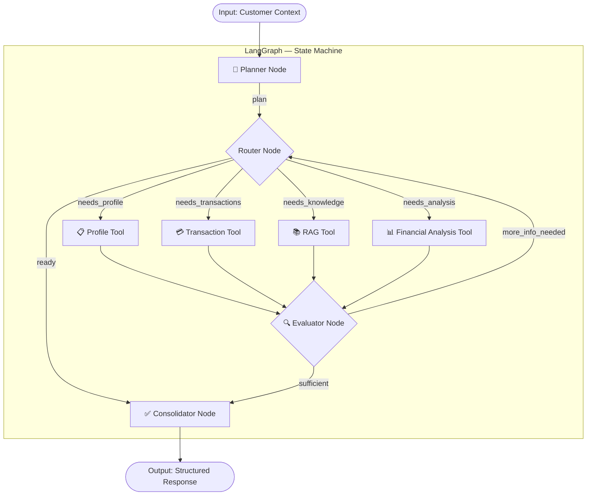
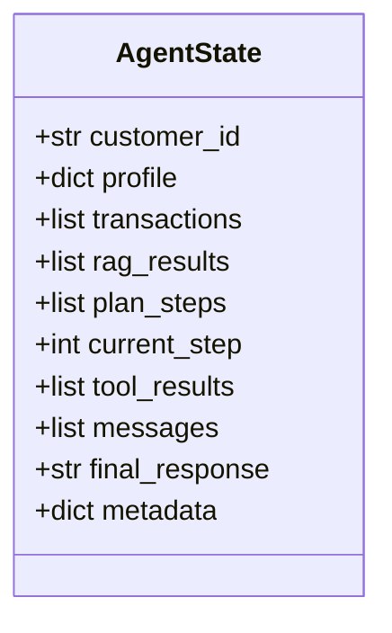
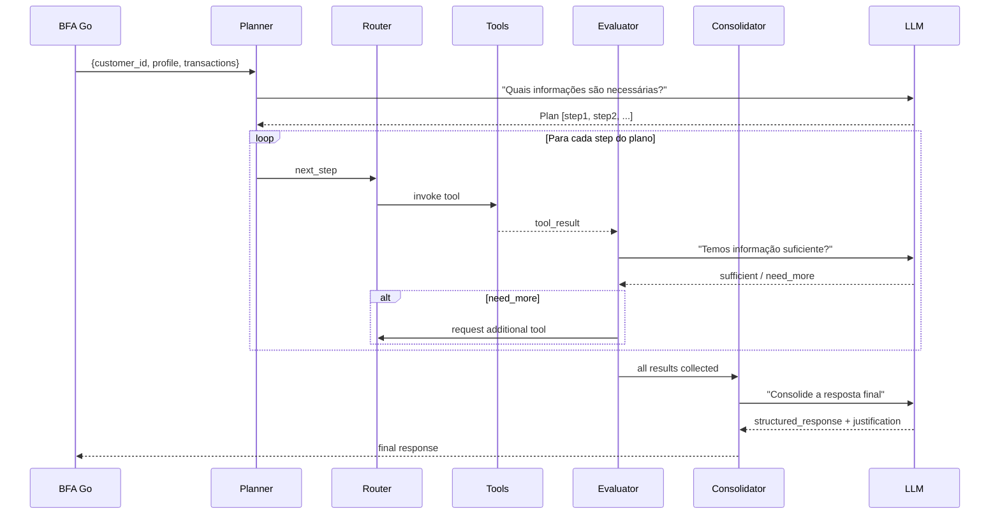
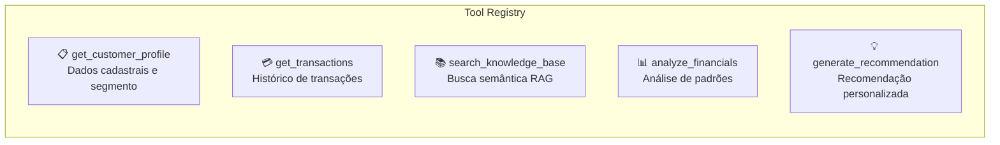
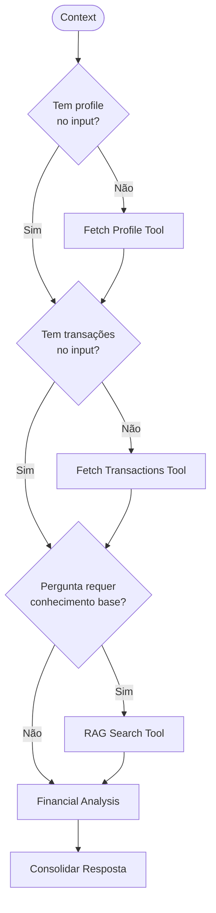
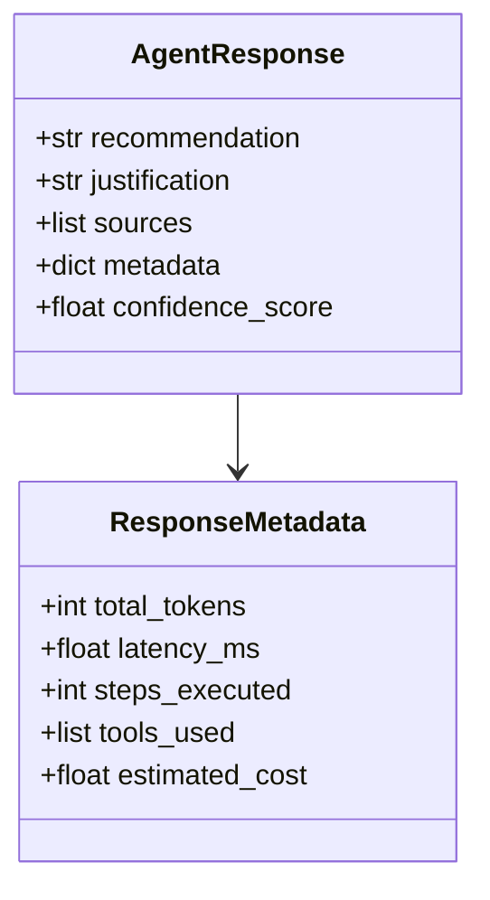
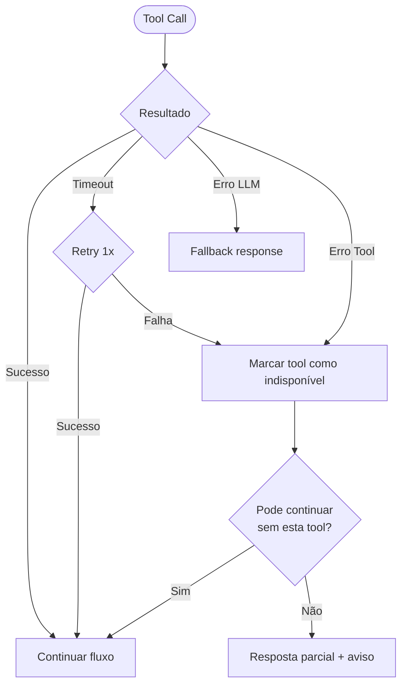

# Agent Workflow — LangGraph

## Grafo de Execução do Agente

## Estado do Agente (State Schema)

## Fluxo Detalhado por Nó

## Tools (Ferramentas)

| Tool | Input | Output | Fallback |
|---|---|---|---|
| `get_customer_profile` | customer_id | Profile dict | Cached profile / erro parcial |
| `get_transactions` | customer_id, period | Transaction list | Últimas N cached |
| `search_knowledge_base` | query, top_k | Relevant chunks | Resposta sem contexto RAG |
| `analyze_financials` | transactions, profile | Analysis dict | Análise simplificada |
| `generate_recommendation` | full_context | Recommendation | Resposta genérica |

## Execução Condicional

## Estrutura da Resposta

## Tratamento de Erros

