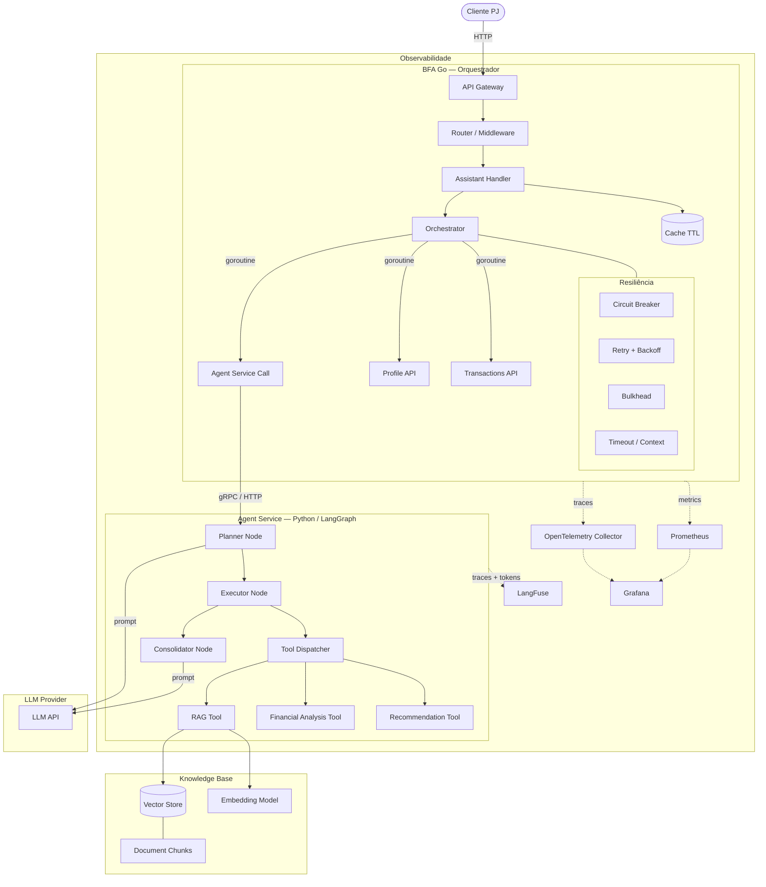
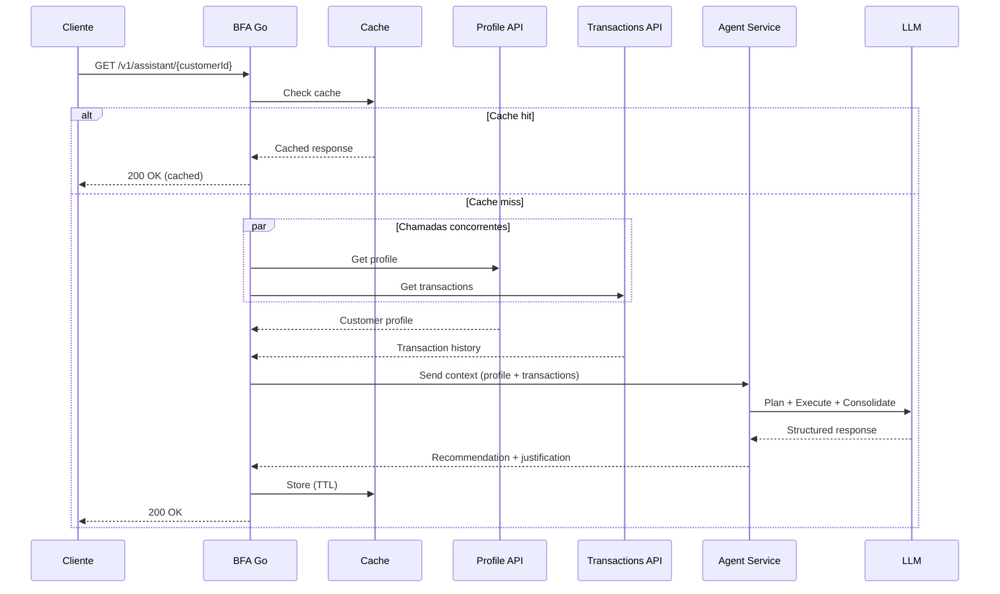
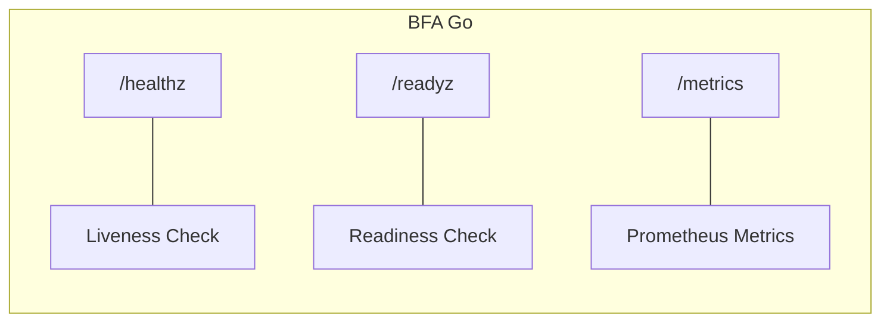
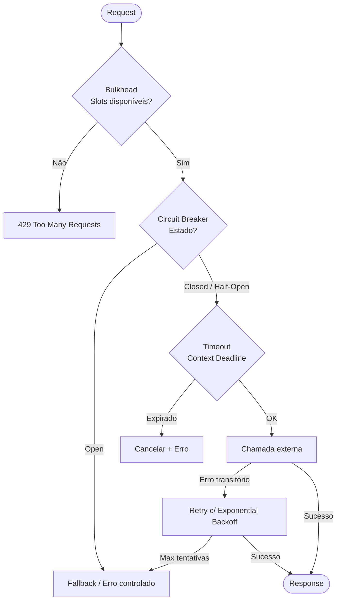
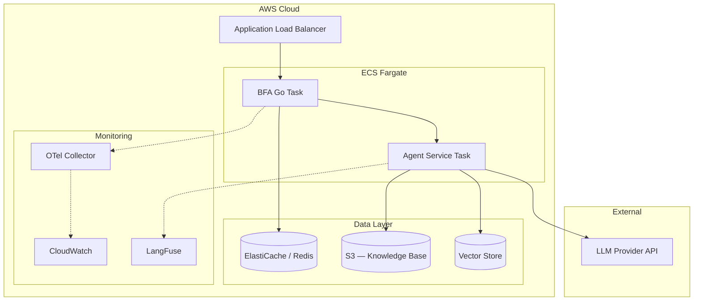
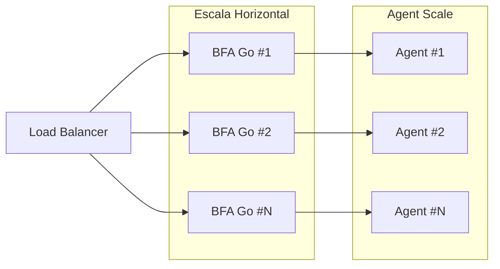

# Arquitetura — AI Banking Assistant

## Visão Geral



## Endpoint Principal

```
GET /v1/assistant/{customerId}
```



## Endpoints de Infraestrutura



## Padrões de Resiliência



## Estratégia de Deploy — AWS



## Comunicação entre Serviços

| De | Para | Protocolo | Motivo |
|---|---|---|---|
| Client | BFA Go | HTTP/REST | Ponto de entrada |
| BFA Go | Profile API | HTTP | Dados do cliente |
| BFA Go | Transactions API | HTTP | Histórico financeiro |
| BFA Go | Agent Service | HTTP/gRPC | Invocação do agente |
| Agent Service | LLM Provider | HTTP | Inferência |
| Agent Service | Vector Store | SDK | Busca semântica |

## Escalabilidade



- **BFA Go**: Stateless, escala horizontalmente via réplicas ECS
- **Agent Service**: Escala independente, separado do BFA
- **Cache**: Redis compartilhado entre instâncias do BFA
- **Vector Store**: Escala vertical ou managed service
