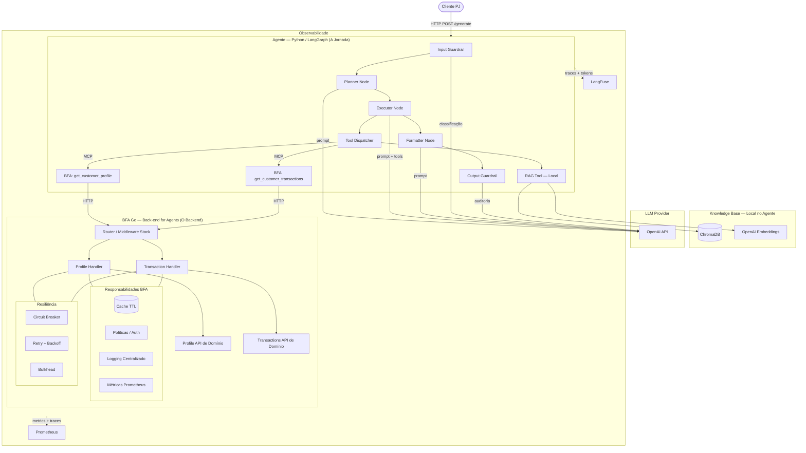
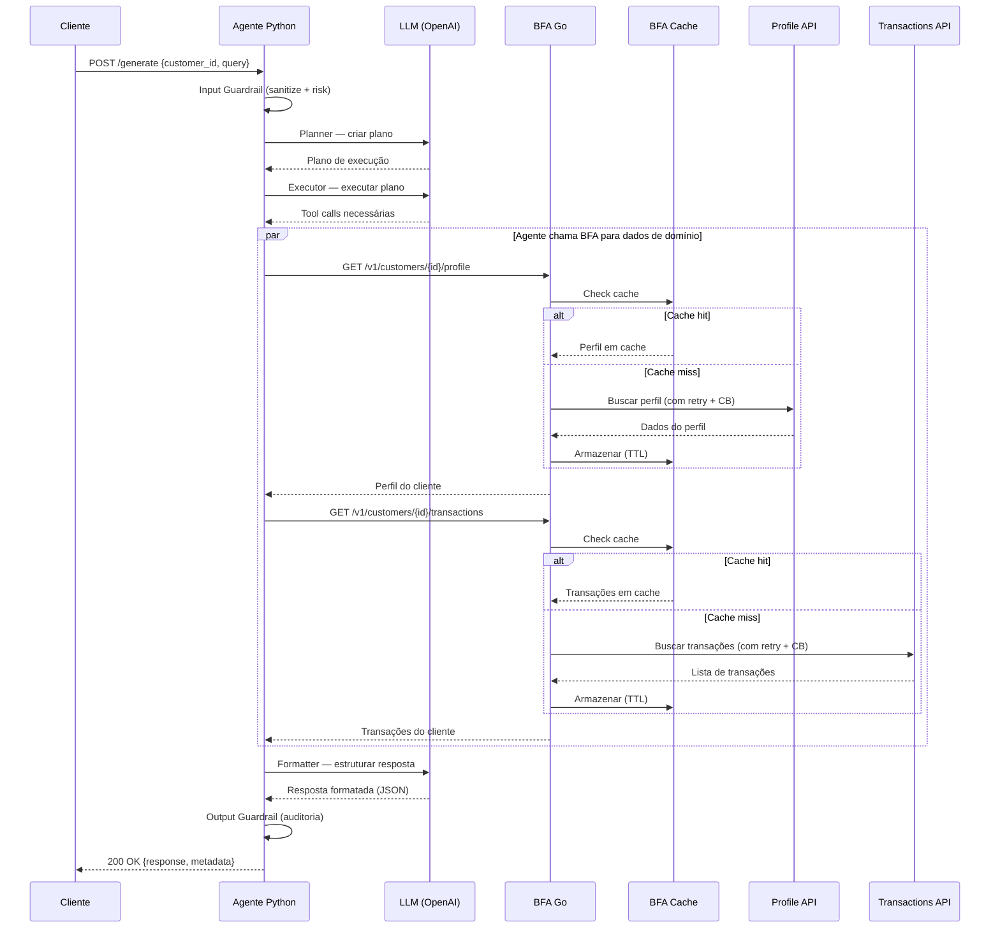
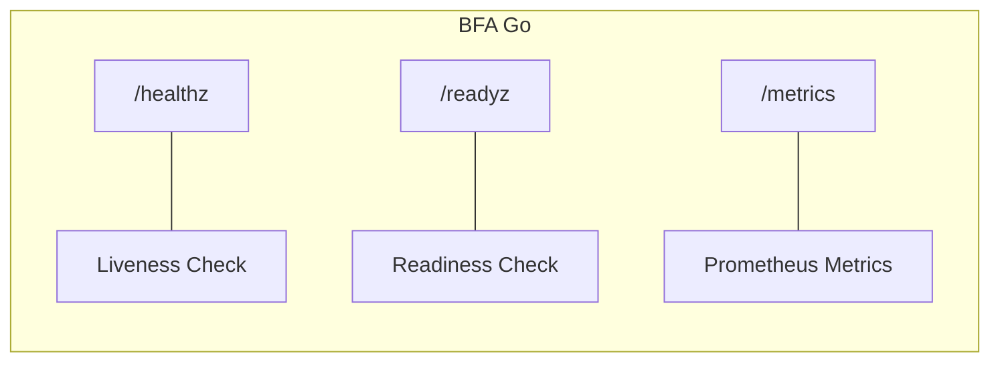
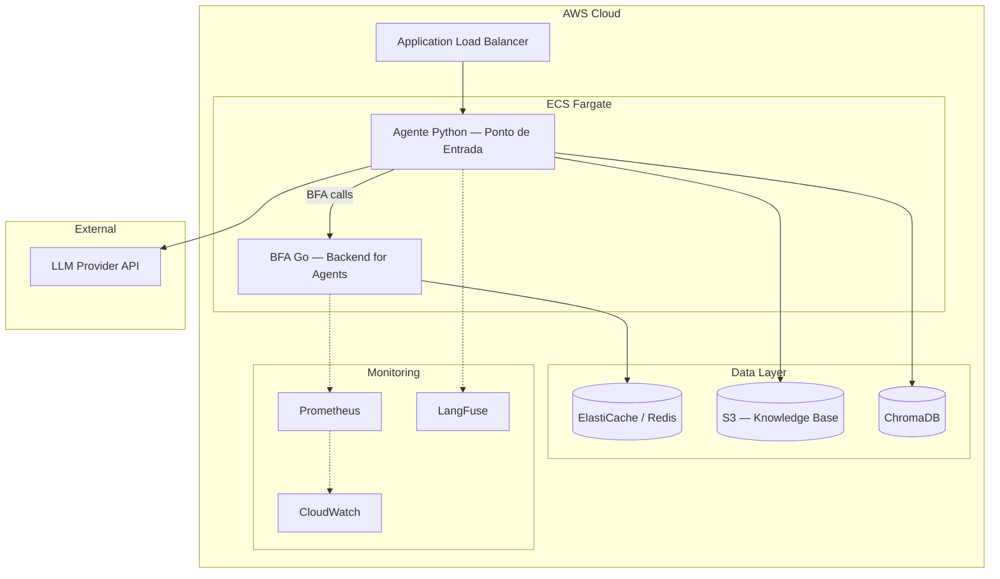
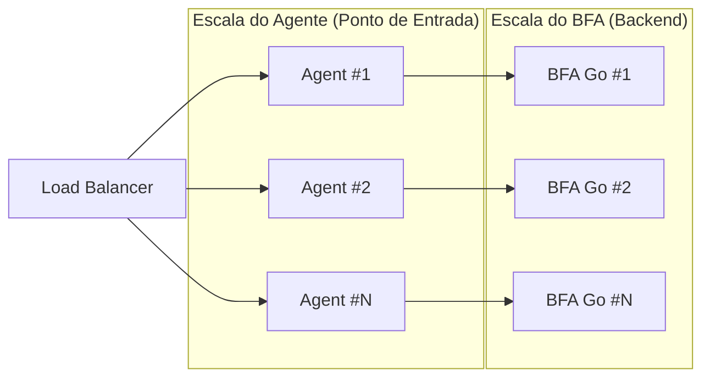

# Arquitetura — AI Banking Assistant (Padrão BFA)

## Visão Geral

A arquitetura segue o padrão **BFA (Back-end for Agents)**, onde:
- O **Agente** (Python/LangGraph) é o ponto de entrada e responsável pela **jornada** do cliente
- O **BFA** (Go) é a camada intermediária que encapsula APIs de domínio com cache, resiliência, logging e políticas

> *"A responsabilidade do agente é a jornada — e não o backend."*



## Fluxo Principal — Padrão BFA

```
Cliente → Agente (LLM + Jornada) → BFA (Cache + Resiliência) → APIs de Domínio
```



## Endpoints de Infraestrutura



## Padrões de Resiliência


## Estratégia de Deploy — AWS (Padrão BFA)



## Contratos do BFA (APIs expostas aos Agentes)

| Endpoint | Método | Domínio | Descrição |
|---|---|---|---|
| `/v1/customers/{id}/profile` | GET | Perfil | Dados cadastrais do cliente |
| `/v1/customers/{id}/transactions` | GET | Transações | Histórico financeiro |
| `/healthz` | GET | Infra | Health check |
| `/readyz` | GET | Infra | Readiness check |
| `/metrics` | GET | Infra | Métricas Prometheus |

## Endpoint do Agente (Ponto de entrada do cliente)

| Endpoint | Método | Descrição |
|---|---|---|
| `/generate` | POST | Recebe `{customer_id, query}` e retorna resposta do assistente |

## Comunicação entre Serviços (Padrão BFA)

| De | Para | Protocolo | Motivo |
|---|---|---|---|
| Cliente | Agente Python | HTTP/REST | Ponto de entrada — a jornada |
| Agente Python | BFA Go | HTTP/REST | Obter dados de domínio (perfil, transações) |
| BFA Go | Profile API | HTTP | Dados do cliente (com cache + resiliência) |
| BFA Go | Transactions API | HTTP | Histórico financeiro (com cache + resiliência) |
| Agente Python | LLM Provider | HTTP | Inferência / raciocínio |
| Agente Python | ChromaDB | SDK | Busca semântica na knowledge base |

## Escalabilidade



- **Agent Python**: Ponto de entrada do cliente — escala horizontalmente via réplicas ECS
- **BFA Go**: Stateless, escala horizontalmente — serve dados de domínio aos agentes
- **Cache**: Redis compartilhado entre instâncias do BFA
- **ChromaDB**: Escala vertical ou managed service
