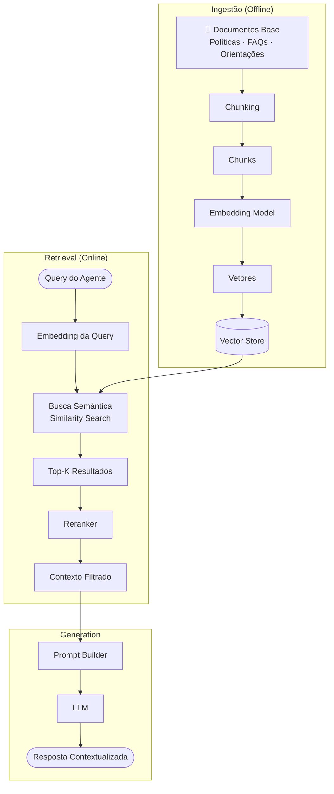
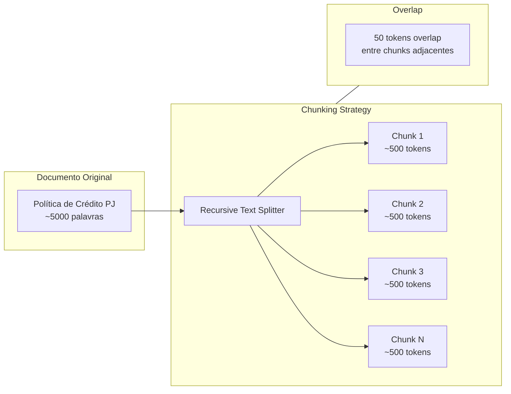
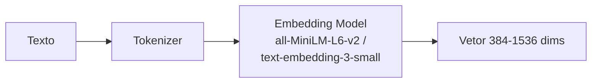
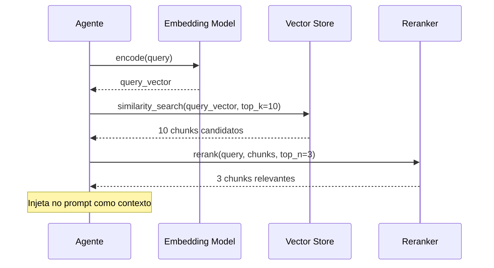
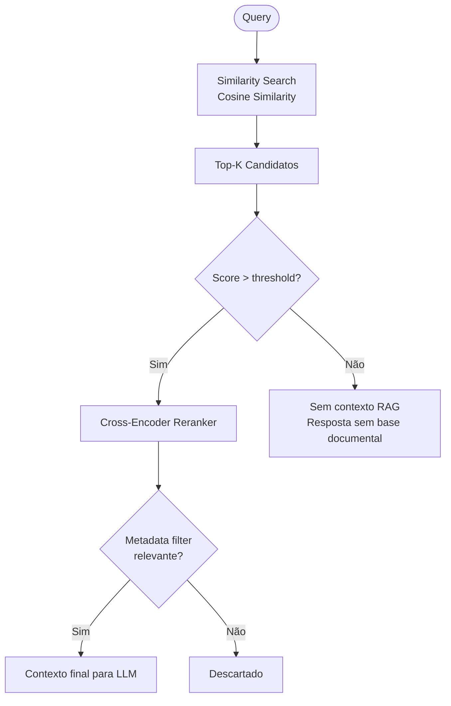
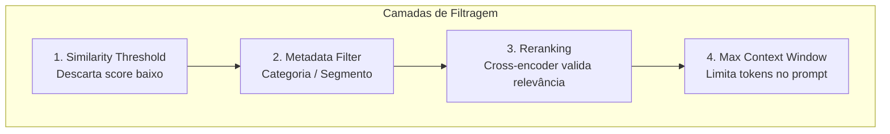
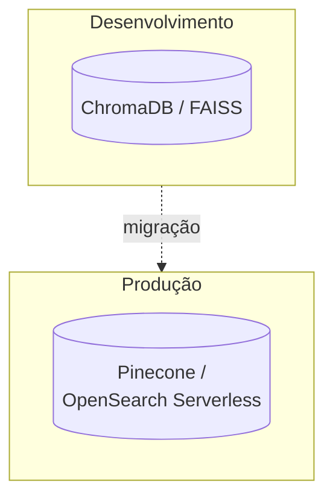
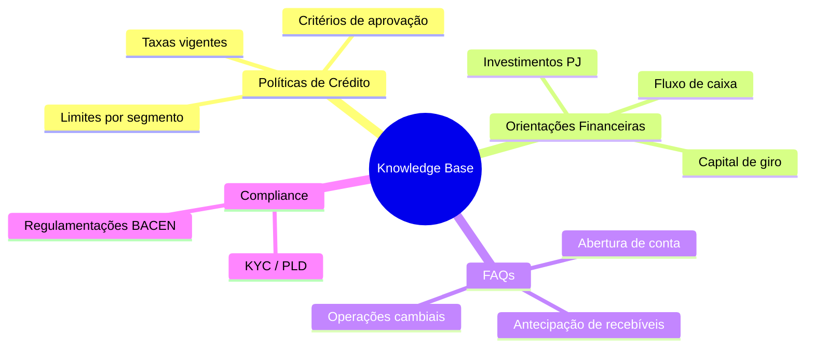

# Estratégia de RAG — Retrieval Augmented Generation

## Pipeline Completo

## Estratégia de Chunking

| Parâmetro | Valor | Justificativa |
|---|---|---|
| Chunk size | ~500 tokens | Equilíbrio entre contexto e precisão |
| Overlap | ~50 tokens | Evita perda de contexto em bordas |
| Separadores | `\n\n` → `\n` → `. ` → ` ` | Respeita estrutura do documento |
| Metadata | título, seção, categoria | Permite filtragem na busca |

## Modelo de Embedding

| Critério | Escolha |
|---|---|
| Modelo local | `all-MiniLM-L6-v2` (384 dims) |
| Modelo cloud | `text-embedding-3-small` (1536 dims) |
| Trade-off | Local = custo zero, cloud = maior qualidade |

## Busca e Recuperação

## Critérios de Recuperação

| Etapa | Threshold | Motivo |
|---|---|---|
| Similarity Score | ≥ 0.7 | Evita chunks muito distantes |
| Reranker Score | Top 3 | Limita contexto no prompt |
| Metadata Match | categoria alinhada | Reduz ruído |

## Evitando Contexto Irrelevante

## Armazenamento Vetorial

## Base de Conhecimento (Exemplos)

