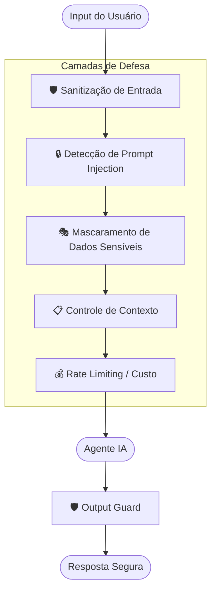
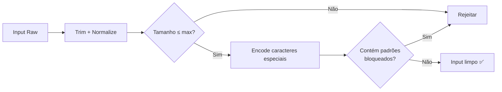
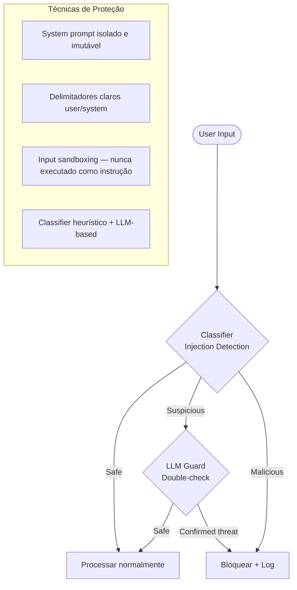
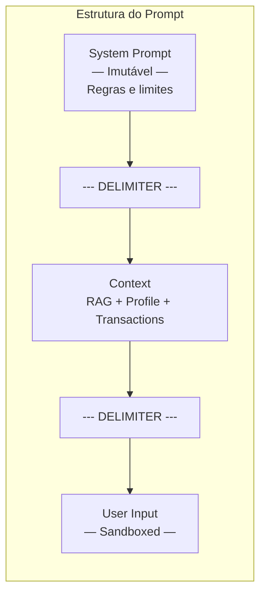
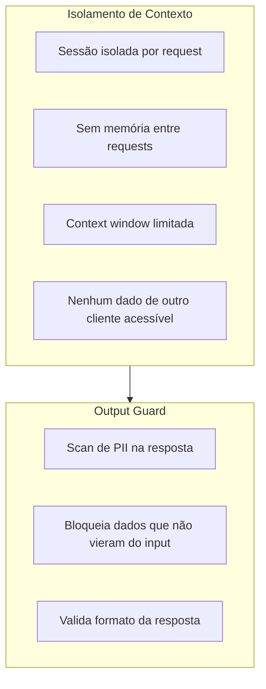
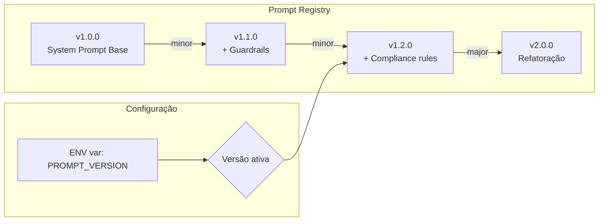
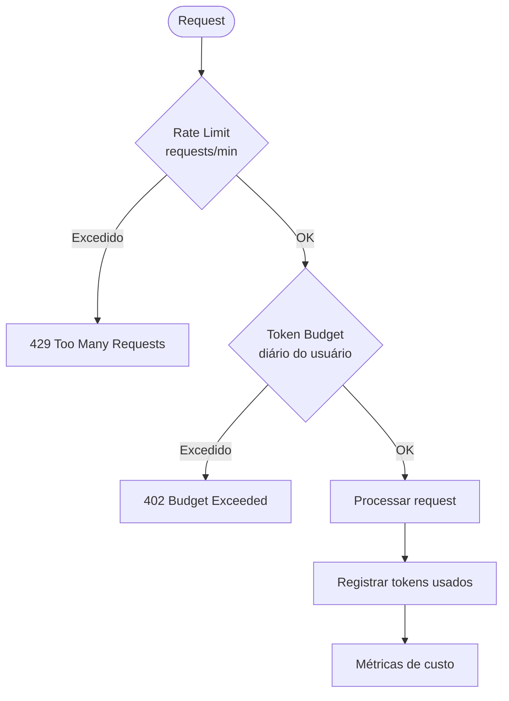
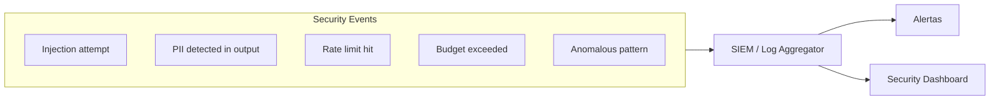

# Segurança e Governança

## Visão Geral das Camadas de Segurança



## Sanitização de Entrada



| Validação | Ação |
|---|---|
| Tamanho máximo | Rejeita inputs > 2000 chars |
| Caracteres especiais | Encode / strip |
| Padrões maliciosos | Blocklist regex |
| Unicode abuse | Normalização NFKC |

## Proteção contra Prompt Injection





## Dados Sensíveis

```mermaid
graph TD
    Data([Dados do Cliente]) --> Detector[PII Detector]

    Detector --> CPF[CPF → ***.***.***-XX]
    Detector --> CNPJ[CNPJ → **.***.***/ ****-XX]
    Detector --> Account[Conta → ****-X]
    Detector --> Email[Email → k***@***.com]
    Detector --> Phone[Telefone → (XX) ****-XXXX]

    CPF --> Masked[Dados Mascarados]
    CNPJ --> Masked
    Account --> Masked
    Email --> Masked
    Phone --> Masked

    Masked --> Agent[Enviado ao Agente / LLM]
```

| Dado | Técnica | Onde aplica |
|---|---|---|
| CPF/CNPJ | Mascaramento parcial | Antes de enviar ao LLM |
| Saldo/Valores | Tokenização | Logs e traces |
| Nome completo | Primeiro nome apenas | Contexto do agente |
| Dados bancários | Nunca enviados ao LLM | Processados apenas no BFA |

## Controle de Vazamento de Contexto



## Versionamento de Prompts



| Aspecto | Abordagem |
|---|---|
| Storage | Prompts versionados em arquivo / config |
| Naming | SemVer (major.minor.patch) |
| Rollback | Troca de versão via env/config |
| Audit | Log de qual versão gerou cada resposta |
| A/B test | Duas versões ativas com split de tráfego |

## Limitação de Custo por Usuário



| Controle | Limite | Ação |
|---|---|---|
| Requests/min | 10 por customer | 429 + retry-after |
| Tokens/dia | 50.000 por customer | 402 + reset time |
| Custo/mês | Budget configurável | Alerta + bloqueio |
| Max input | 2.000 chars | 400 Bad Request |

## Observabilidade de Segurança


